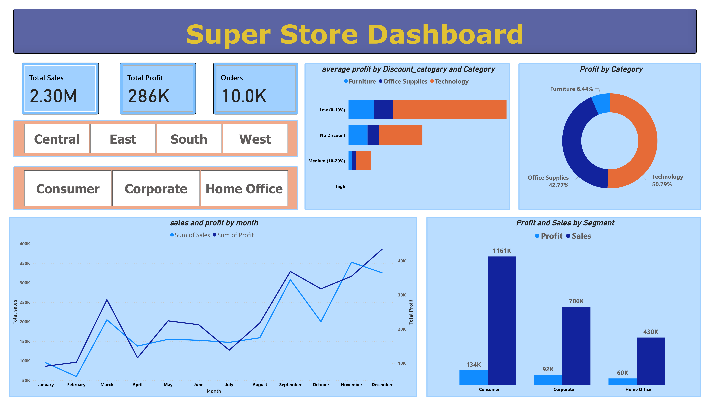

# 🧾 Superstore Sales Power BI Dashboard

An interactive Power BI dashboard project that analyzes retail sales performance, profit trends, discount strategies, and customer segmentation using the Superstore dataset.

---

## 📊 Project Goals:
- Visualize total sales, profit, and order count.
- Analyze monthly sales and profit trends.
- Segment customer contributions and regional performance.
- Assess the impact of discounts on profit using calculated Discount Bands.
- Create interactive, slicer-driven exploration for business decisions.

---

## 💡 Features:
- KPI cards for fast insights.
- Line charts for time-series analysis.
- Discount Band and Category-wise profitability analysis.
- Segment-wise and regional filters using slicers.
- Business-focused, clear visual storytelling.

---

## 🛠️ Tools:
- Microsoft Power BI Desktop
- DAX Calculated Columns
- Power Query Data Transformation

---

## 📂 Project Files:
- `superstore_Dash.pbix` — Complete Power BI report.
- `Sample _Superstore practice.csv` — Raw dataset.
- `superstore_Dash_preview.png` — Screenshot of the final dashboard.

---

## 📸 Preview:

---

## 🚀 Business Impact Simulation:
This dashboard enables retail businesses to:
- Identify profitable and unprofitable product segments.
- Understand discount effects on profitability.
- Optimize regional and customer-focused sales strategies.
